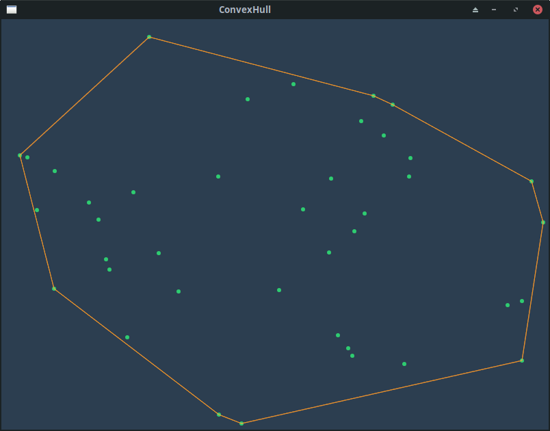
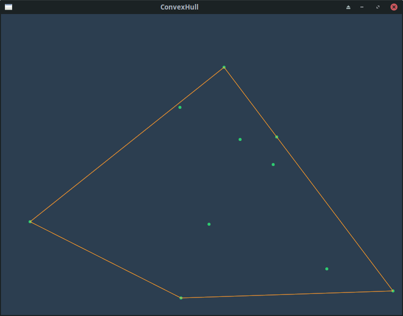

# ConvexHull

# What?

**ConvexHull** is a school project about [Convex Hull](https://en.wikipedia.org/wiki/Convex_hull) in C++.
The goal is to get the smallest convex polygon containing a list of 2d points.

## How?

### Algorithm
Convex Hull is achievable with different algorithms. In our case we use the [Monotone chain algorithm](https://en.wikibooks.org/wiki/Algorithm_Implementation/Geometry/Convex_hull/Monotone_chain).

### Compilation

**Requirements:**
- CMake (>= 3.0)
- gcc (C++ >= 17)
- SFML (>= 2.5.1)

**Steps:**
1. `cd ConvexHull`
2. `cmake ./CMakeLists.txt -B ./output/`
3. `cd output/`
4. `make`

`ConvexHull` executable file is in the `output` folder.

## Usage

*Coming soon...*

## Screenshots

Example #1 with 40 random points

Example #2 with 10 random points
